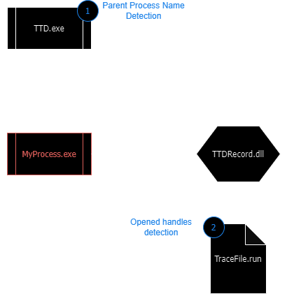

# anti-ttd 👻
#### Different technics to detect (or not) *Time Travel Debugging* 🔎

Because *Windows Time Travel Debugging* (*TTD*) is not a *real* debugger, most classical debugging technics don't work.
This repo compiles all my researches on *TTD* anti-debug.


## Usage

*TTD* can be installed with [the *TTD.exe* command line utility](https://aka.ms/ttd/download), or can be used through *WinDbg*. 
Build the project with cmake and try to record the binary `anti-ttd.exe` with *TTD*.

```
mkdir build
cmake ..
cmake --build .
TTD.exe .\bin\Debug\anti-ttd.exe
```

You can also use *WinDbg* to record the *TTD* trace, see [this tutorial](https://github.com/airbus-cert/ttddbg/blob/main/HOWTO_TIME_TRAVEL.md).

## *TTD* specific anti-debug technics

*TTD* will inject a DLL into the selected process, which could trigger anti-tampering features possibly implemented into the targeted program.
Here is a quick scheme of how *TTD* works under the hood:



With this architecture, I identified two ways to detect *TTD*:

| Technique Name | Detects TTD | Comments |
|:---:|:---:|---|
| Parent Process Name | ✅ | Check if the parent process name is "ttd.exe" |
| Opened Handles | ✅ | Enumerate the handles owned by the process and search for `.run` file |

## Classical anti-debug technics

I test relevent anti-debug technics from [unprotect.it](unprotect.it).

> **Note:** 🔎
>
> Technics with a ❔ haven't been tested yet. Feel free to contribute!

| Technique Name | Detects TTD | Comments |
|:---:|:---:|---|
| Guard Pages | ❌ | Trigger a page guard fault  |
| NtSetDebugFilterState | ✅ | Check if Debug privileges are enabled (Not precise enough) |
| IsDebuggerPresent | ❌ | TTD doesn't activate the debug flag in the PEB |
| INT3 Instruction Scanning | ❔ | ❔ |
| Interrupts | ❔ | ❔ |
| Performing Code Checksum | ❔ | ❔ |
| Unhandled Exception Filter | ❔ | ❔ |
| Detecting Running Process: EnumProcess API | ❔ | ❔ |
| GetLocalTime, GetSystemTime, timeGetTime, NtQueryPerformanceCounter | ❔ | ❔ |
| NtGlobalFlag | ❔ | ❔ |
| Heap Flag | ❔ | ❔ |
| CloseHandle, NtClose | ❔ | ❔ |
| CsrGetProcessID | ❔ | ❔ |
| EventPairHandles | ❔ | ❔ |
| OutputDebugString | ❔ | ❔ |
| NtQueryObject | ❔ | ❔ |
| NtSetInformationThread | ❔ | ❔ |
| NtQueryInformationProcess | ❔ | ❔ |
| CheckRemoteDebuggerPresent | ❔ | ❔ |
| TLS Callback | ❔ | ❔ |
| Call to Interrupt Procedure | ❔ | ❔ |
| AddVectoredExceptionHandler | ❔ | ❔ |
| GetTickCount | ❔ | ❔ |
| RDTSC | ❔ | ❔ |
| Debug Registers, Hardware Breakpoints | ❔ | ❔ |
| LocalSize(0) | ❔ | ❔ |
| INT 0x2D | ❔ | ❔ |
| ICE 0xF1 | ❔ | ❔ |
| Trap Flag | ❔ | ❔ |
| Detecting Window with FindWindow API | ❔ | ❔ |


## Ideas
- [ ] ParentProcessName can be improved by checking if TTDRecord.dll is loaded in the parent process
- [ ] Checks *TTD* recording thread
- [ ] anti-tampering features to detect DLL injection
